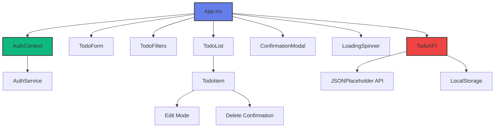
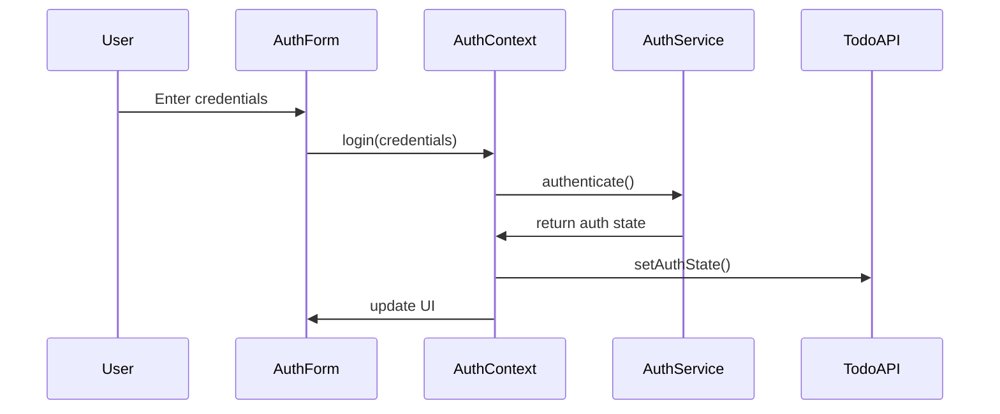
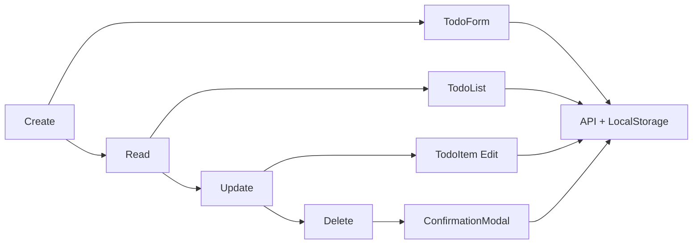
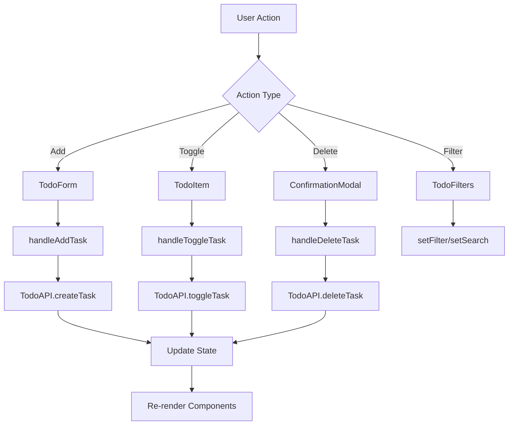
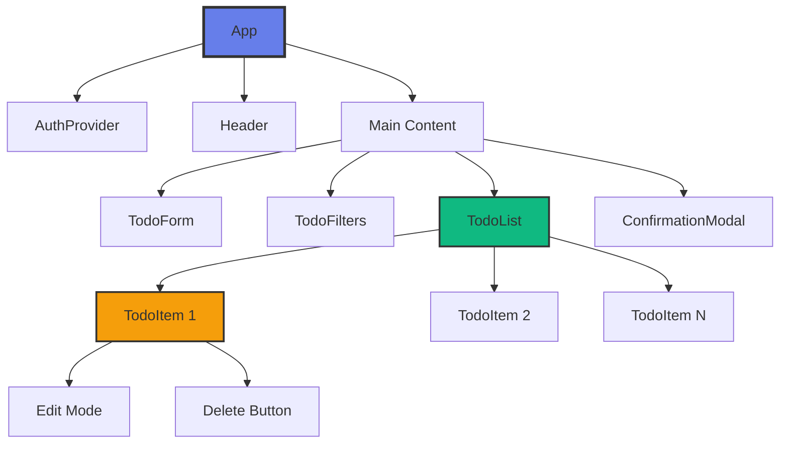
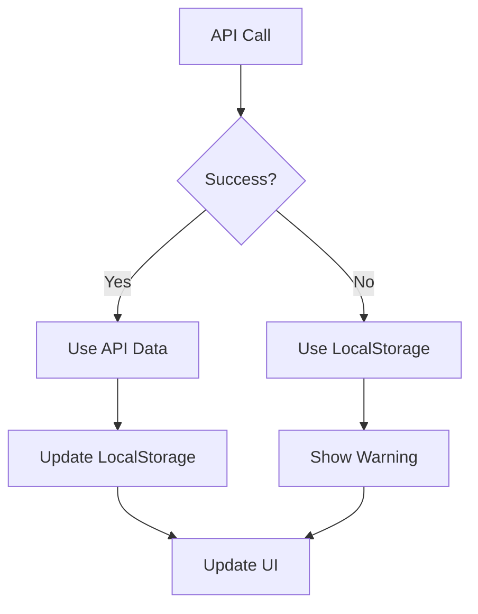
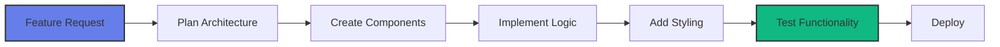

# 📋 React Todo App - Complete Guide

A fully functional, modern Todo List application built with React 18, TypeScript, and modern web technologies. This application demonstrates best practices in React development, including component architecture, state management, API integration, and responsive design.


## 📋 Overview

This is a **fully functional Todo List application** built with **React 18**, **TypeScript**, and modern web technologies. It demonstrates best practices in React development including component architecture, state management, API integration, and responsive design.

## 🏗️ Architecture Overview



## 📁 Project Structure

| Directory | Purpose | Key Files |
|-----------|---------|-----------|
| `src/components/` | Reusable UI components | `TodoForm`, `TodoList`, `TodoItem`, `TodoFilters` |
| `src/services/` | API and business logic | `api.ts`, `auth.ts` |
| `src/contexts/` | React Context providers | `AuthContext.tsx` |
| `src/styles/` | Global styles | `index.css` |
| `src/` | Core application files | `App.tsx`, `types.ts` |

```
src/
├── components/           # Reusable React components
│   ├── AuthForm/         # Authentication form
│   ├── ConfirmationModal/ # Delete confirmation modal
│   ├── LoadingSpinner/   # Loading spinner component
│   ├── TodoFilters/      # Search and filter controls
│   ├── TodoForm/         # Add new task form
│   ├── TodoItem/         # Individual task component
│   └── TodoList/         # Task list container
├── contexts/             # React Context providers
│   └── AuthContext.tsx   # Authentication context
├── services/             # API and data services
│   ├── api.ts           # Todo API service
│   └── auth.ts          # Authentication service
├── styles/              # Global styles
│   └── index.css        # Global CSS
├── App.tsx              # Main application component
├── App.css              # App-specific styles
├── index.tsx            # Application entry point
└── types.ts             # TypeScript type definitions
```

## 🛠️ Technology Stack

| Technology | Version | Purpose |
|------------|---------|---------|
| **React** | 18.2.0 | UI Framework |
| **TypeScript** | 5.9.2 | Type Safety |
| **React Scripts** | 5.0.1 | Build Tools |
| **JSONPlaceholder** | - | Mock API |
| **LocalStorage** | - | Data Persistence |

## ✨ Features

### 🎯 Core Functionality
- **CRUD Operations**: Create, Read, Update, and Delete tasks
- **Task Management**: Add, edit, toggle completion, and delete tasks
- **Real-time Updates**: Immediate UI updates with optimistic rendering
- **Persistent Storage**: Data persists in localStorage and syncs with API

### 🚀 Advanced Features
- **Task Filtering**: Filter tasks by All, Pending, or Completed status
- **Search Functionality**: Search tasks by title with real-time filtering
- **Loading States**: Beautiful loading spinners for all async operations
- **Error Handling**: Comprehensive error handling with user-friendly messages
- **Confirmation Modals**: Delete confirmation to prevent accidental deletions
- **Responsive Design**: Fully responsive design that works on all devices
- **Authentication**: User login/signup system with context management

### 🎨 User Experience
- **Modern UI**: Clean, attractive design with smooth animations
- **Hover Effects**: Interactive elements with hover states
- **Smooth Animations**: CSS transitions and animations for better UX
- **Accessibility**: Keyboard navigation and screen reader support
- **Mobile Optimized**: Touch-friendly interface for mobile devices

## 🔧 Core Features Breakdown

### 1. **Authentication System**


### 2. **CRUD Operations**


## 📊 Data Flow Architecture



## 🎨 Component Hierarchy



## 🗄️ State Management

### Global State (AuthContext)
| State Property | Type | Purpose |
|----------------|------|---------|
| `user` | `AuthUser \| null` | Current authenticated user |
| `token` | `string \| null` | Authentication token |
| `initializing` | `boolean` | Loading state |

### Local State (App Component)
| State Property | Type | Purpose |
|----------------|------|---------|
| `tasks` | `Task[]` | Array of todo tasks |
| `loading` | `boolean` | Initial loading state |
| `error` | `string \| null` | Error messages |
| `filter` | `FilterType` | Current filter (all/pending/completed) |
| `searchTerm` | `string` | Search query |
| `showDeleteModal` | `boolean` | Modal visibility |
| `taskToDelete` | `Task \| null` | Task to be deleted |
| `actionLoading` | `boolean` | Action loading state |

## 🗄️ Data Models

### Task Interface
```typescript
interface Task {
    id: number;           // Unique identifier
    title: string;        // Task description
    completed: boolean;   // Completion status
    userId: number;       // Owner ID
}
```

### Filter Types
```typescript
type FilterType = 'all' | 'pending' | 'completed';
```

## 🌐 API Integration

### Endpoints Used
| Method | Endpoint | Purpose |
|--------|----------|---------|
| `GET` | `/todos?_limit=10` | Fetch tasks |
| `POST` | `/todos` | Create new task |
| `PUT` | `/todos/:id` | Update task |
| `DELETE` | `/todos/:id` | Delete task |

### Fallback Strategy


## 🎯 Key Features Breakdown

### 1. **Task Management**
- ✅ Create new tasks
- ✅ Edit existing tasks
- ✅ Toggle completion status
- ✅ Delete tasks with confirmation

### 2. **Filtering & Search**
- 🔍 Real-time search by title
- 🏷️ Filter by status (All/Pending/Completed)
- 📈 Task statistics display

### 3. **User Experience**
- 🎨 Modern, responsive design
- ⚡ Optimistic updates
- 🔄 Loading states
- ❌ Error handling
- 📱 Mobile-friendly

### 4. **Data Persistence**
- 💾 LocalStorage backup
- 🔄 API synchronization
- 🛡️ Offline functionality

## 🔧 Technical Implementation

### React Hooks Used
| Hook | Purpose |
|------|---------|
| `useState` | Local component state management |
| `useEffect` | Side effects and API calls |
| `useMemo` | Optimized filtering and calculations |
| `useCallback` | Memoized event handlers |
| `useContext` | Global state access |

### State Management


### API Integration

The application integrates with JSONPlaceholder for demonstration purposes and includes:

- **Fallback System**: Local storage backup when API is unavailable
- **Error Handling**: Graceful degradation when network issues occur
- **Mock Data**: Pre-populated with sample tasks for immediate testing

## 🚀 Getting Started

### Prerequisites

- Node.js (version 14 or higher)
- npm or yarn package manager

### Installation

1. **Clone the repository**
   ```bash
   git clone https://github.com/lazyraven/react-todo-app-cursor
   cd react-todo-app-cursor
   ```

2. **Install dependencies**
   ```bash
   npm install
   ```

3. **Start the development server**
   ```bash
   npm start
   ```

4. **Open your browser**
   Navigate to `http://localhost:3000` to view the application

## 🛠️ Available Scripts

| Script | Description |
|--------|-------------|
| `npm start` | Runs the app in development mode |
| `npm run build` | Builds the app for production |
| `npm test` | Launches the test runner |
| `npm run typecheck` | Runs TypeScript type checking |
| `npm run eject` | Ejects from Create React App |

## 🎨 Design System

### Color Palette
| Color | Hex Code | Usage |
|-------|----------|-------|
| Primary | `#667eea` | Buttons, links, primary actions |
| Success | `#10b981` | Completed tasks, success states |
| Danger | `#ef4444` | Delete actions, error states |
| Neutral | `#6b7280` | Text, borders, secondary elements |

### Typography
- **Font Family**: System fonts (San Francisco, Segoe UI, etc.)
- **Font Weights**: 300, 400, 500, 600, 700
- **Responsive**: Scales appropriately on different screen sizes

### Components
- **Cards**: Rounded corners with subtle shadows
- **Buttons**: Consistent styling with hover effects
- **Inputs**: Focus states with color-coded borders
- **Modals**: Overlay with backdrop blur

## 📱 Responsive Design

The application is fully responsive with breakpoints at:

- **Desktop**: 1024px and above
- **Tablet**: 768px - 1023px
- **Mobile**: Below 768px

### Mobile Features
- Touch-friendly buttons and inputs
- Optimized spacing for small screens
- Collapsible filter buttons
- Swipe gestures (future enhancement)

## 📈 Performance Optimizations

| Technique | Implementation | Benefit |
|-----------|----------------|---------|
| **useMemo** | Filtered tasks calculation | Prevents unnecessary re-renders |
| **Optimistic Updates** | UI updates before API response | Better perceived performance |
| **Lazy Loading** | Components load on demand | Faster initial load |
| **Error Boundaries** | Graceful error handling | Better user experience |

## 🧪 Testing

### Manual Testing Checklist
- [ ] User authentication (login/signup)
- [ ] Add new tasks
- [ ] Edit existing tasks
- [ ] Toggle task completion
- [ ] Delete tasks with confirmation
- [ ] Filter tasks by status
- [ ] Search tasks by title
- [ ] Test responsive design
- [ ] Test error scenarios
- [ ] Test offline functionality

## 🚀 Deployment

### Build for Production
```bash
npm run build
```

### Deploy Options
| Platform | Method | Benefits |
|----------|--------|----------|
| **Netlify** | Drag and drop the `build` folder | Easy setup, automatic deployments |
| **Vercel** | Connect your GitHub repository | Zero-config, preview deployments |
| **GitHub Pages** | Use the `gh-pages` package | Free hosting |
| **AWS S3** | Upload the `build` folder to S3 | Scalable, cost-effective |

## 🔮 Future Enhancements

### Planned Features
- 🔐 User authentication with real backend
- 📅 Due dates and reminders
- 🏷️ Task categories and tags
- 🌙 Dark mode toggle
- 📊 Advanced analytics
- 🔄 Real-time collaboration

### Technical Improvements
- 🧪 Unit and integration tests
- 📱 Progressive Web App (PWA)
- 🔄 Service worker for offline support
- 🌐 WebSocket for real-time updates

## 🔧 Development Workflow



## 💡 Key Learning Points

1. **Component Architecture**: Clean separation of concerns
2. **State Management**: Context API for global state
3. **TypeScript**: Type safety throughout the application
4. **API Integration**: Fallback strategies for reliability
5. **User Experience**: Loading states, error handling, confirmations
6. **Responsive Design**: Mobile-first approach
7. **Performance**: Optimistic updates and memoization

## 🤝 Contributing

1. Fork the repository
2. Create a feature branch (`git checkout -b feature/amazing-feature`)
3. Commit your changes (`git commit -m 'Add amazing feature'`)
4. Push to the branch (`git push origin feature/amazing-feature`)
5. Open a Pull Request

### Development Guidelines
- Follow TypeScript best practices
- Maintain component reusability
- Write meaningful commit messages
- Test your changes thoroughly
- Update documentation as needed

## 📄 License

This project is licensed under the MIT License - see the [LICENSE](LICENSE) file for details.

## 🙏 Acknowledgments

- [JSONPlaceholder](https://jsonplaceholder.typicode.com/) for the mock API
- [React](https://reactjs.org/) for the amazing framework
- [Create React App](https://create-react-app.dev/) for the development setup
- [TypeScript](https://www.typescriptlang.org/) for type safety

## 📞 Support

If you have any questions or need help with the application:

- Create an [issue](https://github.com/lazyraven/react-todo-app-cursor/issues)
- Check the [documentation](https://github.com/lazyraven/react-todo-app-cursor#readme)
- Review the [code examples](https://github.com/lazyraven/react-todo-app-cursor/tree/main/src)

---

**Built with ❤️ using React and TypeScript**

<div align="center">
  <a href="https://github.com/lazyraven/react-todo-app-cursor">
    
  </a>
  <a href="https://github.com/lazyraven/react-todo-app-cursor/fork">
    
  </a>
  <a href="https://github.com/lazyraven/react-todo-app-cursor/issues">
    
  </a>
</div>
---

# 📋 Todo List Application

A fully functional, modern Todo List application built with React. This application demonstrates best practices in React development, including component architecture, state management, API integration, and responsive design.


**Built with ❤️ using React**


## ✨ Features

### Core Functionality
- **CRUD Operations**: Create, Read, Update, and Delete tasks
- **Task Management**: Add, edit, toggle completion, and delete tasks
- **Real-time Updates**: Immediate UI updates with optimistic rendering
- **Persistent Storage**: Data persists in localStorage and syncs with API

### Advanced Features
- **Task Filtering**: Filter tasks by All, Pending, or Completed status
- **Search Functionality**: Search tasks by title with real-time filtering
- **Loading States**: Beautiful loading spinners for all async operations
- **Error Handling**: Comprehensive error handling with user-friendly messages
- **Confirmation Modals**: Delete confirmation to prevent accidental deletions
- **Responsive Design**: Fully responsive design that works on all devices

### User Experience
- **Modern UI**: Clean, attractive design with smooth animations
- **Hover Effects**: Interactive elements with hover states
- **Smooth Animations**: CSS transitions and animations for better UX
- **Accessibility**: Keyboard navigation and screen reader support
- **Mobile Optimized**: Touch-friendly interface for mobile devices

## 🚀 Getting Started

### Prerequisites
- Node.js (version 14 or higher)
- npm or yarn package manager

### Installation

1. **Clone the repository**
   ```bash
   git clone <repository-url>
   cd todo-list-app
   ```

2. **Install dependencies**
   ```bash
   npm install
   ```

3. **Start the development server**
   ```bash
   npm start
   ```

4. **Open your browser**
   Navigate to `http://localhost:3000` to view the application

## 📁 Project Structure

```
src/
├── components/           # Reusable React components
│   ├── ConfirmationModal/    # Delete confirmation modal
│   ├── LoadingSpinner/       # Loading spinner component
│   ├── TodoFilters/          # Search and filter controls
│   ├── TodoForm/             # Add new task form
│   ├── TodoItem/             # Individual task component
│   └── TodoList/             # Task list container
├── services/            # API and data services
│   └── api.js              # Todo API service
├── styles/              # Global styles
│   └── index.css            # Global CSS
├── App.js               # Main application component
├── App.css              # App-specific styles
└── index.js             # Application entry point
```

## 🔧 API Integration

The application integrates with [JSONPlaceholder](https://jsonplaceholder.typicode.com/) for demonstration purposes and includes:

- **Fallback System**: Local storage backup when API is unavailable
- **Error Handling**: Graceful degradation when network issues occur
- **Mock Data**: Pre-populated with sample tasks for immediate testing

### API Endpoints Used
- `GET /todos` - Fetch all tasks
- `POST /todos` - Create new task
- `PUT /todos/:id` - Update existing task
- `DELETE /todos/:id` - Delete task

## 🎨 Design System

### Color Palette
- **Primary**: `#667eea` (Purple gradient)
- **Success**: `#10b981` (Green)
- **Danger**: `#ef4444` (Red)
- **Neutral**: `#6b7280` (Gray)

### Typography
- **Font Family**: System fonts (San Francisco, Segoe UI, etc.)
- **Font Weights**: 300, 400, 500, 600, 700
- **Responsive**: Scales appropriately on different screen sizes

### Components
- **Cards**: Rounded corners with subtle shadows
- **Buttons**: Consistent styling with hover effects
- **Inputs**: Focus states with color-coded borders
- **Modals**: Overlay with backdrop blur

## 🛠️ Technical Implementation

### React Hooks Used
- `useState` - Local component state
- `useEffect` - Side effects and API calls
- `useMemo` - Optimized filtering and calculations

### State Management
- **Local State**: Component-level state for UI interactions
- **API State**: Server state with loading and error handling
- **Derived State**: Computed values from primary state

### Performance Optimizations
- **Memoization**: Filtered tasks are memoized to prevent unnecessary re-renders
- **Lazy Loading**: Components load only when needed
- **Optimistic Updates**: UI updates immediately, then syncs with server

## 📱 Responsive Design

The application is fully responsive with breakpoints at:
- **Desktop**: 1024px and above
- **Tablet**: 768px - 1023px
- **Mobile**: Below 768px

### Mobile Features
- Touch-friendly buttons and inputs
- Optimized spacing for small screens
- Collapsible filter buttons
- Swipe gestures (future enhancement)

## 🧪 Testing

### Manual Testing Checklist
- [ ] Add new tasks
- [ ] Edit existing tasks
- [ ] Toggle task completion
- [ ] Delete tasks with confirmation
- [ ] Filter tasks by status
- [ ] Search tasks by title
- [ ] Test responsive design
- [ ] Test error scenarios
- [ ] Test offline functionality

## 🚀 Deployment

### Build for Production
```bash
npm run build
```

### Deploy Options
- **Netlify**: Drag and drop the `build` folder
- **Vercel**: Connect your GitHub repository
- **GitHub Pages**: Use the `gh-pages` package
- **AWS S3**: Upload the `build` folder to S3

## 🔮 Future Enhancements

### Planned Features
- **User Authentication**: Login/signup functionality
- **Task Categories**: Organize tasks by categories
- **Due Dates**: Set deadlines for tasks
- **Priority Levels**: Mark tasks as high/medium/low priority
- **Dark Mode**: Toggle between light and dark themes
- **Drag & Drop**: Reorder tasks by dragging
- **Bulk Actions**: Select multiple tasks for batch operations
- **Export/Import**: Backup and restore task data

### Technical Improvements
- **TypeScript**: Add type safety
- **Testing**: Unit and integration tests
- **PWA**: Progressive Web App features
- **Offline Support**: Service worker for offline functionality
- **Real-time Sync**: WebSocket integration for live updates

## 🤝 Contributing

1. Fork the repository
2. Create a feature branch (`git checkout -b feature/amazing-feature`)
3. Commit your changes (`git commit -m 'Add amazing feature'`)
4. Push to the branch (`git push origin feature/amazing-feature`)
5. Open a Pull Request

## 📄 License

This project is licensed under the MIT License - see the [LICENSE](LICENSE) file for details.

## 🙏 Acknowledgments

- [JSONPlaceholder](https://jsonplaceholder.typicode.com/) for the mock API
- [React](https://reactjs.org/) for the amazing framework
- [Create React App](https://create-react-app.dev/) for the development setup

---

## Prompt
## I wrote down this Prompt :
- Create a fully functional To-Do List application using React.

**Requirements:**

1. **API Integration:**

   - Fetch tasks from a mock or real API (e.g., JSONPlaceholder or a custom endpoint).

   - Support CRUD operations (Create, Read, Update, Delete).

2. **Component Structure:**

   - Use reusable/common components such as TodoItem, TodoForm, and TodoList.

   - Maintain a clean folder structure (components, services, styles).

3. **Design & Styling:**

   - Apply modern, responsive CSS (use plain CSS or CSS Modules).

   - The UI should look clean and attractive with hover effects, spacing, and smooth animations  for adding/removing tasks.

4. **Enhancements:**

   - Implement a task filter (All, Completed, Pending).

   - Add a search bar to quickly find tasks.

   - Show a loading spinner while fetching data.

   - Include a confirmation popup before deleting a task.

5. **Code Quality:**

   - Use React hooks (useState, useEffect).

   - Write code that is well-commented and easy to understand.

   - Ensure proper error handling for API calls.

**Deliverables:**

   - React code (JSX + CSS).

   - Clear file/folder structure.

   - Example API response for testing.

   - Styled and fully functional in the browser.


## I write down this prompt give me a crash course on  @https://github.com/lazyraven/react-todo-app-cursor 
use mermain diagrams and markdown tables, It give me this result in Readme file

